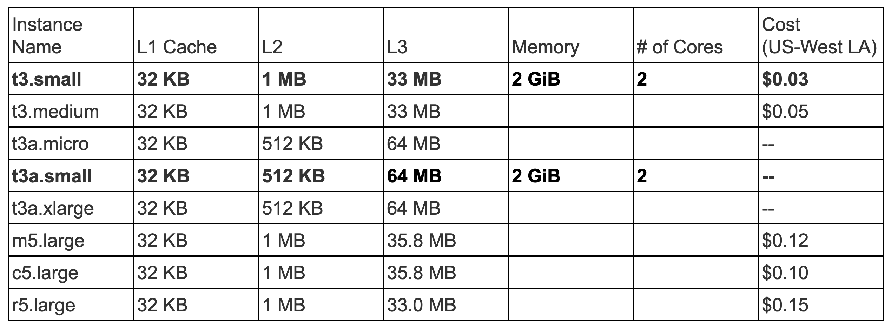

<!-- START OF DOCUMENT -->
# dsc291team4/HW2 - Our Course of Action Plan (OCAP) is as follows:
### OCAP for the question:
### _*How does the performance of random-poke.py relate to the size of the caches in the ec2 instance?*_
1. _**step 1** Find the instances which have a significant difference in their L1, L2 and L3 cache sizes. (Currently not sure where we are going to find this info (goto #a )_
1. _**step 2**  Perform random-poke.py on these instances and investigate the distribution of latency times for different size arrays._
1. _**step 3** Explore the data with *Graphs* and prepare the final notebook_

## Le Grande TODO List
### First, Immediate TODO List: 
> Let $x2 =$ the max L2 cache size for the given type of ec2 instance. Then, for some small number, $d$:
- [ ] measure $N$ random_pokes at $x = x2 - d$
- [ ] measure $N$ random_pokes at $x = x2 + d$
- [ ] make here in this google doc, a table with a make-believe datum for a random_- [ ] data run that has a value for a measure of performance and all relevant explanatory variables 
- [ ] Use ^^those to estimate the order of magnitude for N = our sample size ($\sim10^3$ samples? more?) 
    - [ ] first estimate order of magnitude for the change of response

### Then, tasks for all (feel free to check them off as you finish them)
<!-- - [x] @mentions, #refs, [links](), **formatting**, and <del>tags</del> supported -->
- [ ] Perform random-poke.py on these instances and investigate the distribution of latency times for different size arrays.
- [ ] Compare: t3, t3a (2 populations, explanatory variable) → expect different performance (latency)

- [ ] On block sizes of (10, 20, 30, 40, 50, 60) MB perform 1000 random pokes to get the latency times on t3.small and t3a.small instances. Calculate the mean and standard deviation on the 1000 pokes data thus collected.  Plot block size vs latency (mean/ std dev.) graph for each instance. 
- [ ] Make graphs with data (see section "**Graphs**")
- [ ] Condense/crystalize all results into a briefest Jupyter notebook (graphs returned by graphing functions if they're complicated)

<!-- ### TODO: tasks for tim ###
## - [ ] TODO: add table of contents
## - [ ] TODO: add flow chart of workflows?
## - [ ] TODO: turn this md into a template for next time and automate it's admin
## - [ ] TODO: add links to md file google sheet and from task list
## - [x] TODO: ask team if they have any good file stamping options
-->

## Summary of experimental design
Recall our thesis question,
> How does the performance of random-poke.py relate to the size of the L3 cache in the ec2 instance?

Specifically, we will be measuring performance of the t3.small and t3a.small EC2 instances in terms of their latency when performing random-poke.py with varying block sizes.  In particular, t3.small has an L3 cache size of 33MB and t3a.small has an L3 cache size of 64MB. To keep other variables constant as much as possible, these EC2 instances were chosen because they each have 2 cores and 2 GiB of memory. 

Our experiment will consist of choosing a single hour during a high load time and a single hour during a low load time to run random-poke.py with varying block sizes each 1,000 times on both a t3.small EC2 instance and a t3a.small EC2 instance. The block sizes will range from size 10MB to 60MB, and will increase by 10MB at each step. We will compare the means and standard deviations of the latency times between the two EC2 instances in order to see how the performance of random-poke.py differs on these instances of differing L3 cache sizes.

 <figure>
  
  <figcaption>Tab.1 - Table of cache sizes.  See the team Google Sheet here https://docs.google.com/spreadsheets/d/1465ndQZ5gJlcT8u6P8b-lDIHBbaSgUaUT9svXKVKuho/edit#gid=0</figcaption>
</figure>

## Graphs:
1. Comparing the performance for a particular ec2 instance for varying data chunk size (x : data chunk size , y : performance)
1. Comparing performance between different ec2 instances for a given data chunk size (x: ec2 instance, y : performance) (place the above two graphs in the same graph)
1. Comparing performance for ec2 instances for different times of day 
1. X axis  = size of L3 cache in ec2 instances, Y axis is performance 
(cache-miss rate?) ← similar to latency 
1. X axis = log of latency times, Y axis = frequency

## Description of Experimental Tests

> - Null Hypothesis: Cache sizes have no affect on latency times.
> - Alternative Hypothesis: Higher cache size leads to lower latency times.
> - Design a p-test to reject or retain the null hypothesis. (Ask the Professor about this)

> - Null Hypothesis: Cache sizes have no effect on latency times.
> - Alternative Hypothesis: Higher cache size leads to lower latency times.
> - Design a p-test to reject or retain the null hypothesis. (Ask the Professor/Tim about this)
> - Empirical test 
>     - use scipy.stats.kstest to compare two samples without assuming normality
>     - use scipy.stats.shapiro to test if a sample is normal

> - Null Hypothesis: L3 cache sizes have no effect on the performance of ec2 clusters for block sizes = 10, 20, 30, 40, 60. 
> - Alternate Hypothesis: Higher cache size leads to lower latency times (better performance) depending on the block size.
> - Qualitative Hypothesis: We expect t3.small and t3a.small to perform similarly when the given block size fits within both of their caches. Since t3a.small has a larger cache size than t3.small, on block sizes which are larger than the L3 cache of t3.small but smaller than the L3 cache of t3a.small, we expect t3a.small to outperform t3.small.  
> - Hypothesis Testing: In particular, a p-test will be done separately for each block size. We will report the block sizes which have significant differences in their latency times, and conclude with how EC2 instances' performance relates to the L3 cache size.

## Variables to consider: 
* Time of day (choose an hour during a high load time and an hour during a low load * time?) 
* Number of repeated experiments to run per time of day 
* Block sizes: Yoav suggested varying them between 10 MB and 60 MB since we're only measuring L3 cache  

#### **Statistical p-test**
The Kolmagorov-Smirnov test (scipy.stats.kstest) provides statistically valid p-tests for whether or not two samples were drawn from the same distribution.  No assumptions are made other than, I believe, they share a common domain (collection of arguments).

Example usage:
> from sci py.stats import kstest

> x1_values = (  …  )

> x2_values = (  …  )

> kstest( x1_test , x2_test )

## Key Terms
- cores = VCPU feature → # of workers/parallelization 

## Acknowledgements
Nota bene: much of the functionality for measurements is forked from the github repository located <url = https://github.com/yoavfreund/Public-DSC291/>here</url>.

<!-- END OF DOCUMENT -->